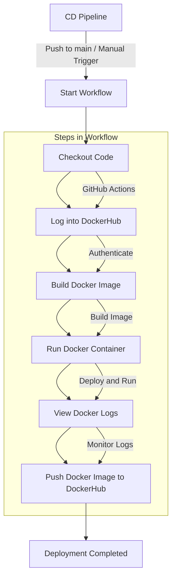

# Continuous Deployment (CD) Pipeline

This repository includes a GitHub Actions workflow to automate the Continuous Deployment (CD) of the project. The workflow ensures that every push to the `main` branch builds, tests, and deploys a Docker image for the project.



## **Workflow Details**

### **Trigger**
The workflow is triggered on:
1. **Push Events**: When changes are pushed to the `main` branch.
2. **Manual Dispatch**: The workflow can also be triggered manually using the "Run workflow" option in the GitHub Actions UI.

---

## **Jobs**

### **Job: `archtype`**

This job is executed on an `ubuntu-22.04` runner and consists of the following steps:

---

### **1. Checkout Code**
**Action Used**: `actions/checkout@v3`  
This step checks out the latest code from the repository to the GitHub Actions runner.

```yaml
- name: Checkout code
  uses: actions/checkout@v3
```

---

### **2. Log into DockerHub**
**Action Used**: `docker/login-action@v2`  
This step logs into DockerHub using the credentials stored as GitHub Secrets:
- **DOCKER_USERNAME**: Your DockerHub username.
- **DOCKER_PASSWD**: Your DockerHub password.

```yaml
- name: Log into DockerHub
  uses: docker/login-action@v2
  with:
    username: ${{ secrets.DOCKER_USERNAME }}
    password: ${{ secrets.DOCKER_PASSWD }}
```

---

### **3. Build Docker Image**
This step builds a Docker image for the project using the `docker build` command.  
The image is tagged with your DockerHub username and the repository name (`mage-project`).

```yaml
- name: Build Docker Image
  run: docker build -t ${{ secrets.DOCKER_USERNAME }}/mage-project .
```

---

### **4. Run Docker Container**
This step runs the Docker container in detached mode using the image built in the previous step.  
The container is named `mage-project`.

```yaml
- name: Run Docker Container
  run: docker run -d --name mage-project ${{ secrets.DOCKER_USERNAME }}/mage-project
```

---

### **5. View Docker Logs**
This step retrieves and displays the logs of the running Docker container, allowing you to verify the application's output.

```yaml
- name: View Docker Logs
  run: docker logs mage-project
```

---

### **6. Push Docker Image**
This step pushes the built Docker image to DockerHub with the `latest` tag, making it available for deployment.

```yaml
- name: Push Docker Image
  run: docker push ${{ secrets.DOCKER_USERNAME }}/mage-project:latest
```

---

## **Secrets Used**
The workflow requires the following secrets to be configured in your GitHub repository:
1. **DOCKER_USERNAME**: Your DockerHub username.
2. **DOCKER_PASSWD**: Your DockerHub password.

To add these secrets:
1. Go to your repository on GitHub.
2. Navigate to `Settings` > `Secrets and variables` > `Actions`.
3. Add the secrets with the respective names.

---

## **How It Works**
1. **Code is Pushed**: When code is pushed to the `main` branch, the workflow starts automatically.
2. **Docker Image is Built**: A Docker image is built using the project's `Dockerfile`.
3. **Image is Deployed Locally**: The image is deployed as a running container on the GitHub Actions runner.
4. **Logs Are Verified**: The container logs are displayed to confirm successful execution.
5. **Image is Pushed to DockerHub**: The final Docker image is pushed to DockerHub with the `latest` tag.

---

## **Usage**
### **Manual Trigger**
To trigger the workflow manually:
1. Go to the `Actions` tab in your GitHub repository.
2. Select the "CD Pipeline" workflow.
3. Click on the "Run workflow" button and confirm.

### **Automatic Trigger**
Simply push changes to the `main` branch, and the workflow will execute automatically.

---

This pipeline streamlines the process of building, testing, and deploying Dockerized applications, ensuring consistency and reliability in your deployments.
